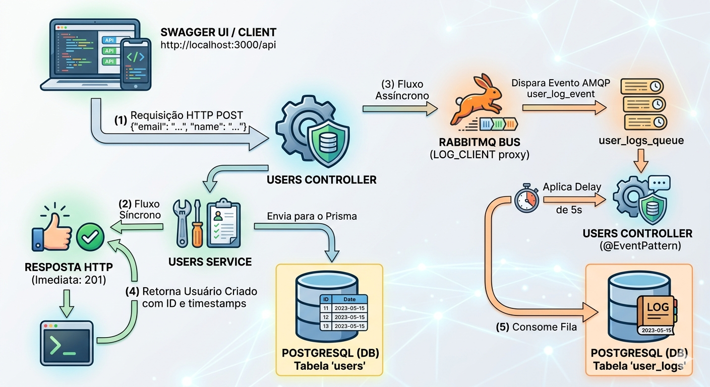

# API NestJS com Prisma 7 & RabbitMQ 🐋🚀

Uma API RESTful de alta performance desenvolvida em Node.js utilizando o framework **Node(NestJS)**, integrada com o ORM **Prisma 7**, banco de dados **PostgreSQL** e mensageria assíncrona com **RabbitMQ**. Todo o ecossistema é totalmente containerizado utilizando **Docker**. Documentação APIs **Swegger**.

## 👤 Desenvolvedor
* **Tiago Honorio Matos da Silva**
* **tiago_honorio2010@hotmail.com**

---

## 🛠️ O que a aplicação faz?

A aplicação gerencia um cadastro completo de usuários utilizando uma **Arquitetura Baseada em Eventos (Event-Driven Architecture)** para auditoria de logs em segundo plano com **RabbitMQ**.

### Fluxo de Funcionamento:
1. **Operações Síncronas (HTTP REST):** Quando um cliente faz uma requisição HTTP (`POST`, `PATCH`, `DELETE`) para gerenciar um usuário, a API valida e persiste a alteração no banco de dados PostgreSQL instantaneamente e devolve a resposta imediata para o cliente (garantindo baixíssima latência).
2. **Mensageria Assíncrona (RabbitMQ):** No mesmo instante em que a resposta HTTP é enviada, a API publica um evento contendo os dados da ação (`CREATE`, `UPDATE` ou `DELETE`) em uma fila de mensageria do **RabbitMQ** (`user_logs_queue`).
3. **Processamento em Segundo Plano (Background Worker):** Um consumidor interno escuta essa fila, aguarda um tempo predefinido (atraso simulado de 5 segundos) e persiste o histórico de auditoria na tabela de logs (`UserLogs`). Como a tabela de logs é independente, o histórico é preservado de forma segura mesmo que o usuário original venha a ser deletado do sistema.
<p align="center">
  
</p>

## 🚀 Tecnologias Utilizadas

* **[NestJS](https://nestjs.com)** - Framework TypeScript estruturado para construir APIs escaláveis.
* **[Prisma 7](https://prisma.io)** - ORM de última geração com suporte a arquivos de configuração avançados (`prisma.config.ts`).
* **[RabbitMQ](https://rabbitmq.com)** - Broker de mensagens de código aberto para comunicação assíncrona baseada em filas.
* **[PostgreSQL](https://postgresql.org)** - Sistema de banco de dados relacional robusto e confiável.
* **[Docker & Docker Compose](https://docker.com)** - Ferramentas para isolamento, containerização e orquestração de serviços.
* **[Swagger (OpenAPI)](https://swagger.io)** - Interface gráfica interativa para documentação e testes automatizados.

---

## 📦 Como Dar um Start na Aplicação

Como todo o ecossistema foi containerizado e configurado com checagens de integridade físicas (*healthchecks*), você não precisa ter o Node.js, PostgreSQL ou RabbitMQ instalados fisicamente na sua máquina.
1. **Clonar o projeto**
   ```bash
   git clone git@github.com:20100000/api_nest_rabbitMQ.git
   ```
Certifique-se de ter o Docker ativo no seu terminal e execute a sequência abaixo na **raiz do projeto**:

2. **Parar e limpar instâncias ou volumes antigos por segurança:**
   ```bash
   docker compose down -v
   ```

3. **Construir as imagens e iniciar todos os serviços de forma limpa:**
   ```bash
   docker compose up --build
   ```

*O comando do Docker Compose executará automaticamente a sincronização das tabelas do Prisma, gerará os arquivos de tipagem TypeScript, populará a semente de dados inicial (Seed) com a Alice e o Bob e iniciará o servidor do NestJS assistindo modificações em tempo real.*

---

## 🌐 Como Testar a Aplicação via Swagger

A API conta com uma interface de testes visual e automatizada que dispensa o uso de ferramentas como Postman ou Insomnia.

### Link de Acesso:
👉 **[http://localhost:3000/api]** (ou `http://127.0.0`)

### Passo a Passo para Testar:

1. **Listar Usuários Iniciais (GET):**
   * Procure pelo bloco `GET /users`.
   * Clique em **"Try it out"** e depois no botão azul **"Execute"**.
   * Você verá o retorno em JSON dos usuários cadastrados no *Seed* (`Alice` e `Bob`).

2. **Criar um Usuário e Disparar a Fila (POST):**
   * Procure pelo bloco `POST /users`.
   * Clique em **"Try it out"**.
   * No campo *Request body*, altere o JSON colocando um e-mail novo e um nome de sua preferência.
   * Clique em **"Execute"**.
   * **O teste do fluxo:** A resposta HTTP contendo o usuário criado aparecerá **na hora** na tela. No entanto, se você olhar o terminal do seu Docker, verá que o RabbitMQ receberá a mensagem e aguardará **5 segundos** antes de salvar o log na tabela de auditoria.

3. **Verificar os Logs de Auditoria (GET):**
   * Procure pelo bloco `GET /users/logs`.
   * Clique em **"Try it out"** e depois em **"Execute"**.
   * O histórico de ações (`CREATE`, `UPDATE` ou `DELETE`) processadas pela fila do RabbitMQ estará listado em ordem cronológica.

4. **Testar Atualização (PATCH) e Deleção (DELETE):**
   * Você pode usar as rotas `PATCH /users/{id}` ou `DELETE /users/{id}` passando o ID do usuário criado. 
   * A resposta HTTP continuará sendo instantânea e os logs correspondentes de `UPDATE` e `DELETE` entrarão na fila de auditoria em segundo plano normalmente.

---
## 📊 Outros Links Úteis de Monitoramento

* **API REST (Dados puros users) GET:** `http://localhost:3000/users`
* **API REST (Dados puros userLogs) GET:** `http://localhost:3000/users/logs`
* **Painel Administrativo do RabbitMQ:** `http://localhost:15672`
  * **Usuário:** `guest`
  * **Senha:** `guest`
  * *(Utilize este painel web para monitorar graficamente as taxas de envio e o consumo de mensagens na fila `user_logs_queue`).*


